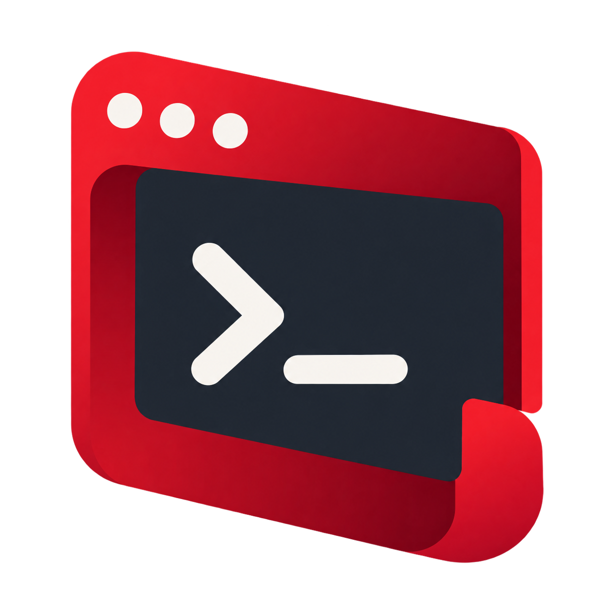

# Red Studio

A native pixel-scene workbench for Red projects. Red Studio uses the native `andy-gui` window backend for its desktop UI and keeps project, document, task, HTTP, JSON and gallery code in Red modules.



## Run

The checked-out Red repository should sit beside this folder at `~/Desktop/Red`, with its interpreter built at `Red/build/red`.

```sh
./studio/run.sh
```

`RED_EXECUTABLE` can point to another Red interpreter and `RED_STUDIO_PROJECT` can select the project to open. The default project is the sibling `Red` checkout.

To render the same native pixel scene without opening a macOS window:

```sh
./studio/run-headless.sh
```

Headless mode writes the native scene protocol to `/tmp/red-studio.scene` (override with `RED_STUDIO_SCENE`) and exits. It does not start the native window process.

## Current workbench

- Project explorer with lazy one-directory-at-a-time navigation, text-file tabs, create, rename and confirmed file delete.
- Background text search across Red source, documentation and common project files.
- Per-tab editing buffers, dirty markers, atomic save, and basic keyboard editing.
- Dirty buffers are written to temporary recovery files and restored on a later launch.
- Background Red run, build and test jobs with output and duration reporting.
- HTTP GET and POST inspector for plain HTTP, including editable JSON bodies, response headers and JSON formatting.
- JSON file view and native component gallery.
- Dark native pixel layout with status and output panels.

Keyboard shortcuts: `Ctrl+S` save, `Ctrl+R` run, `Ctrl+B` build an executable, `Ctrl+Shift+B` compile bytecode, `Ctrl+Shift+F` format, `Ctrl+T` test, arrow keys move the editor cursor, `F2` rename the selected file, and `Ctrl+D` then type `DELETE` to confirm deletion. `Ctrl+Alt+S` opens Save As. Click **New file** in the explorer to enter a filename. The Search view runs a project search in a background task. The Tasks view shows queued, running and completed work. In the HTTP view, edit the URL, toggle the method between GET and POST, and click **Send**; click the body panel to edit a POST JSON body.

The current Red HTTP client is plain HTTP only. The source editor is intentionally a lightweight buffer/editor foundation, not a language-server editor.

## Standalone executable

Build the standalone macOS executable from the Red interpreter in the sibling checkout:

```sh
mkdir -p dist
../Red/build/red build studio/main.red -o dist/RedStudio
```

Launch the bundled program with the native backend using `./studio/run-built.sh`, or render it without a window using `./studio/run-built-headless.sh`. The launcher supplies the sibling `andy-gui` backend and project path. Set `RED_EXECUTABLE` only for the source-based launch scripts; the standalone program does not need the Red interpreter at runtime.
